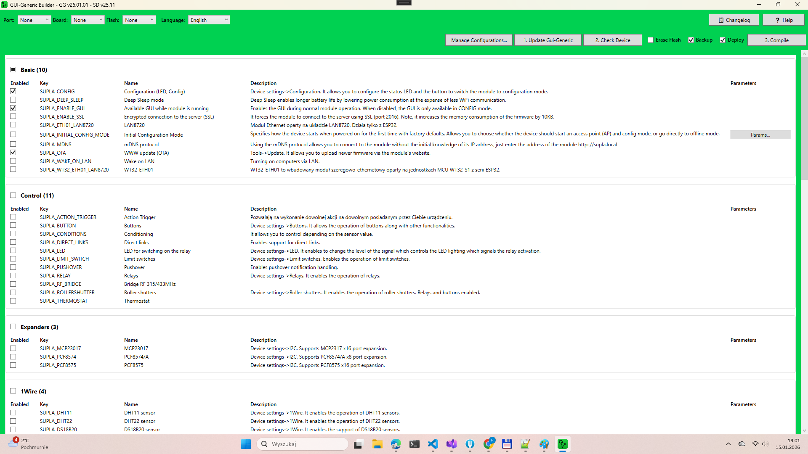

# Gui-Generic Builder Desktop

## Overview

Gui-Generic Desktop is a desktop application written in .NET WPF that allows users to build Supla firmware with different options.

## Prerequisites

Platform.io must be installed in its default location.
Install Vistual Studio Code and then install the Platform.io extension or just Platform.io CLI.

## Supported devices

- ESP32
- ESP32-C6
- ESP32-C3
- ESP32-S3

## Not supported devices

- ESP8266

## Configuration variables in appsettings.json file
- `AutoUpdateEnabled` - if set to `true`, the application will check for updates on startup and automatically download and install them. Default value is `true`.
- `AutoUpdateMaxVersion` - the maximum version of the application that can be automatically updated to. If the latest version is higher than this value, the application will not update and will prompt the user to manually download the latest version. Default value is `100.0.0`, which means there is no maximum version limit for automatic updates.
- `GGLocal` - the path to the local folder with Gui-Generic files.
