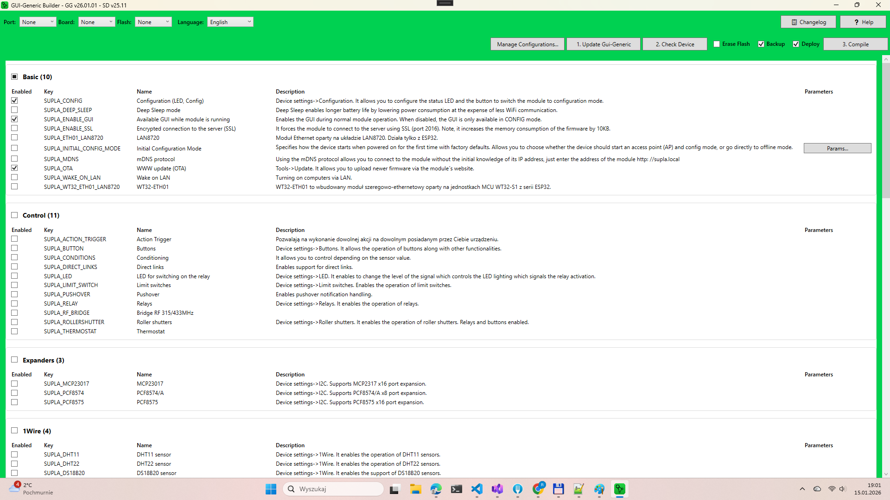

# Gui-Generic Builder Desktop

## Overview

Gui-Generic Desktop is a desktop application written in .NET WPF that allows users to build Supla firmware with different options.



## Prerequisites

PlatformIO is the recommended build option. Install Visual Studio Code with the PlatformIO extension, or install the PlatformIO CLI in its default location.

### Arduino CLI (alternative)

Arduino CLI is an alternative build handler. It compiles firmware for the supported ESP32 devices and ESP8266, and can optionally upload it to a device over the selected serial port. It does not require a `platformio.ini` file. PlatformIO is recommended for ESP32 because the Arduino CLI build is slower and less reliable. ESP8266 is supported only through Arduino CLI; the available PlatformIO `esp8266_nolibs` environment does not include the libraries required by the full firmware.

The Arduino CLI executable is included with the application, so a separate Arduino CLI installation is not normally needed. Its executable is in the application output/installation directory. If you use a separately installed Arduino CLI instead, make sure it is available on `PATH`.

The ESP32 board platform must be installed once on the computer running the application. Open PowerShell in the directory containing the bundled `arduino-cli.exe` and run:
```powershell
.\arduino-cli.exe core update-index
.\arduino-cli.exe core install esp32:esp32
```

This downloads the Espressif ESP32 platform and its required tools and cores to Arduino CLI's data directory (by default `%LOCALAPPDATA%\Arduino15` on Windows). An internet connection is required. To verify that the platform is installed, run:
```powershell
.\arduino-cli.exe core list
```

To use ESP8266, install the ESP8266 Arduino core using its board manager index:
```powershell
.\arduino-cli.exe config add board_manager.additional_urls https://arduino.esp8266.com/stable/package_esp8266com_index.json
.\arduino-cli.exe core update-index
.\arduino-cli.exe core install esp8266:esp8266
```


## Supported devices

- ESP32
- ESP32-C6
- ESP32-C3
- ESP32-S3
- ESP8266 (Arduino CLI only)

## Configuration variables in appsettings.json file
- `AutoUpdateEnabled` - if set to `true`, the application will check for updates on startup and automatically download and install them. Default value is `true`.
- `AutoUpdateMaxVersion` - the maximum version of the application that can be automatically updated to. If the latest version is higher than this value, the application will not update and will prompt the user to manually download the latest version. Default value is `100.0.0`, which means there is no maximum version limit for automatic updates.
- `GGLocal` - the path to the local folder with Gui-Generic files.
